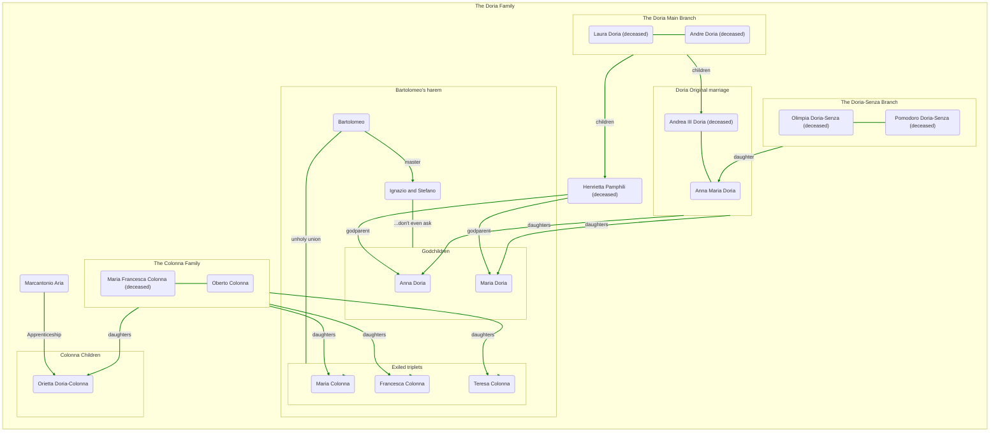

```mermaid 
flowchart TD
doria_morfar("Pomodoro Doria-Senza (deceased)")
doria_mormor("Olimpia Doria-Senza (deceased)")
doria_farfar("Andre Doria (deceased)")
doria_farmor("Laura Doria (deceased)")
%% -- Parents --
colonna_far("Oberto Colonna")
colonna_mor("Maria Francesca Colonna (deceased)")
doria_ste_mor("Anna Maria Doria")
doria_far("Andrea III Doria (deceased)")
%% -- Characters of parents gen --
god_aunt("Henrietta Pamphili (deceased)")
creepy_uncle("Bartolomeo")
fencer("Marcantonio Aria")
%% -- Children --
orietta("Orietta Doria-Colonna")
c_triplet_1("Maria Colonna")
c_triplet_2("Francesca Colonna")
c_triplet_3("Teresa Colonna")
doria_d1("Anna Doria")
doria_d2("Maria Doria")
%% -- Characters of childrens gen --
actually_dogs("Ignazio and Stefano")
%% -- relationships --

subgraph creepy_non_family["Bartolomeo's harem"]
	direction LR
	creepy_uncle ===|unholy union| triplets
	actually_dogs ===|...don't even ask| god_children
end

subgraph triplets["Exiled triplets"]
    direction TB
    c_triplet_1
    c_triplet_2
    c_triplet_3
end 

subgraph colonna_parents["The Colonna Family"]
	direction RL
	colonna_far === colonna_mor
end

subgraph colonna_children["Colonna Children"]
    direction RL
    orietta
    c_triplet_1
    c_triplet_2
    c_triplet_3
end

subgraph doria_family["The Doria Family"]
	direction TB
	doria_maternal_grandparents
	doria_paternal_grandparents 
    doria 
    colonna_parents
    colonna_children
    god_children
    god_aunt
    fencer
    creepy_non_family
end 

subgraph doria_maternal_grandparents["The Doria-Senza Branch"]
	direction RL
	doria_morfar === doria_mormor
end

subgraph doria_paternal_grandparents["The Doria Main Branch"]
	direction RL
	doria_farfar === doria_farmor
end

subgraph doria["Doria Original marriage"]
	direction RL
	doria_far === doria_ste_mor
end

subgraph god_children["Godchildren"]
	direction RL
	doria_d1
	doria_d2
end


doria_maternal_grandparents -->|daughter| doria_ste_mor
doria_paternal_grandparents -->|children| doria_far & god_aunt
god_aunt -->|godparent| doria_d1 & doria_d2
colonna_parents -->|daughters| orietta & c_triplet_1 & c_triplet_2 & c_triplet_3
creepy_non_family --> c_triplet_1 & c_triplet_2 & c_triplet_3
doria -->|daughters| doria_d1 & doria_d2
fencer -->|Apprenticeship| orietta
creepy_uncle -->|master| actually_dogs

linkStyle default stroke-width:2px,fill:none,stroke:green;
```
