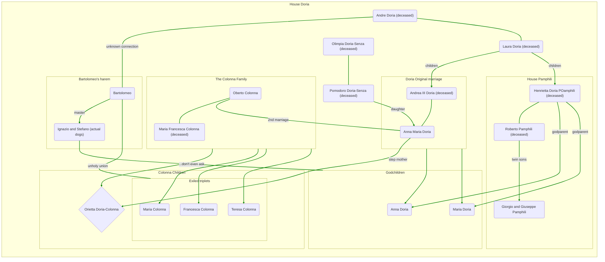

```mermaid 


```mermaid
flowchart TB

doria_morfar("Pomodoro Doria-Senza (deceased)")

doria_mormor("Olimpia Doria-Senza (deceased)")

doria_farfar("Andre Doria (deceased)")

doria_farmor("Laura Doria (deceased)")

%% -- Parents --

colonna_far("Oberto Colonna")

colonna_mor("Maria Francesca Colonna (deceased)")

doria_ste_mor("Anna Maria Doria")

doria_far("Andrea III Doria (deceased)")

%% -- Characters of parents gen --

god_aunt("Henrietta Doria POamphili (deceased)")

creepy_uncle("Bartolomeo")

god_aunt_man("Roberto Pamphili (deceased)")

%% -- Children --

orietta{"Orietta Doria-Colonna"}

c_triplet_1("Maria Colonna")

c_triplet_2("Francesca Colonna")

c_triplet_3("Teresa Colonna")

doria_d1("Anna Doria")

doria_d2("Maria Doria")

%% -- Characters of childrens gen --

actually_dogs("Ignazio and Stefano (actual dogs)")

pamphili_twins("Giorgio and Giuseppe Pamphili")

%% -- relationships --

  
  

subgraph pamphili["House Pamphili"]

direction LR

god_aunt === god_aunt_man

-->|twin sons| pamphili_twins

end

  

subgraph colonna_parents["The Colonna Family"]

direction LR

colonna_far === colonna_mor

end

  

subgraph colonna_children["Colonna Children"]

direction LR

triplets

orietta

end

  

subgraph doria_family["House Doria"]

direction TB

doria_morfar

doria_mormor

doria_farfar

doria_farmor

doria

god_aunt

orietta

god_children

colonna_parents

colonna_children

creepy_non_family

pamphili

end

  

subgraph creepy_non_family["Bartolomeo's harem"]

direction LR

creepy_uncle ===|unholy union| triplets

actually_dogs ===|...don't even ask| god_children

end

  

subgraph triplets["Exiled triplets"]

direction LR

c_triplet_1

c_triplet_2

c_triplet_3

end

  
  

subgraph doria["Doria Original marriage"]

direction RL

doria_far === doria_ste_mor

end

  

subgraph god_children["Godchildren"]

direction RL

doria_d1

doria_d2

end

  

doria_farfar ===|unknown connection|creepy_uncle

doria_farfar === doria_farmor -->|children| doria_far & god_aunt

doria_mormor === doria_morfar -->|daughter| doria_ste_mor

god_aunt -->|godparent| doria_d1 & doria_d2

creepy_uncle --> |master| actually_dogs

colonna_parents --> orietta & c_triplet_1 & c_triplet_2 & c_triplet_3

colonna_far ===|2nd marriage| doria_ste_mor

doria_ste_mor -->|step mother| orietta

doria --> doria_d1 & doria_d2

  
  

linkStyle default stroke-width:2px,fill:none,stroke:green;
```

```
